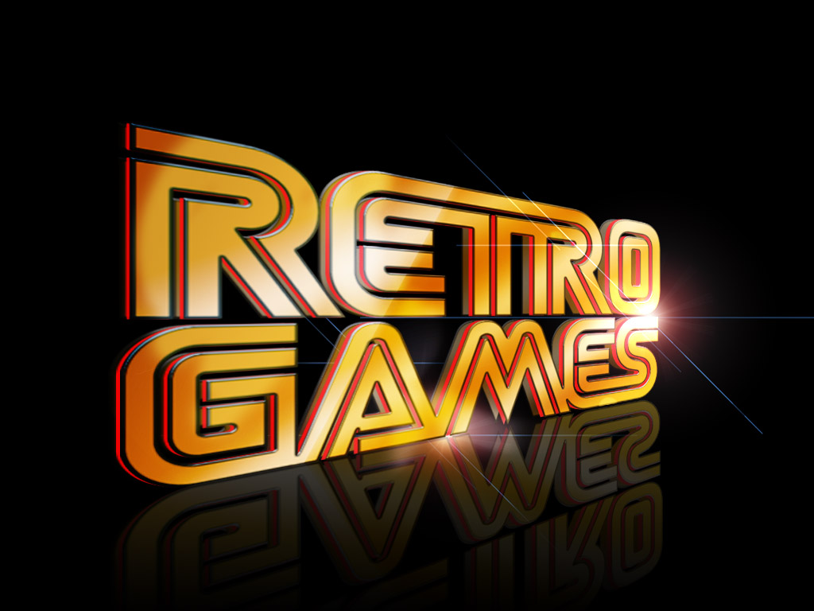

# Retro Gaming

# Project Contributors

- [Nicole Cook](https://github.com/Nicole1701)

- [Daren Hamilton](https://github.com/darenhamilton)

- [Michelle Hamilton](https://github.com/michelin96)

- [Erin Hislope](https://github.com/ehislope)

- [Johnny Whitaker](https://github.com/MrATX)

# Project Specifics

## Are Retro Game Profits in the Secondary Market Predictable?

In 1977, Atari released the Atari 2600, a gaming console that featured not only a joystick control, but also game cartridges which allowed users to play multiple games on one system, effectively launching a new era in video games and spawning such classics as Space Invaders and Pac Man. By 1985, Nintendo entertainment System (NES) found it's way to the US markets and put out such hits as Super Mario Brothers and The Legend of Zelda.

Throughout the 1980's and 1990's, other popular consoles were put on the market, each offering their own collection of games and appealing to a variety of players and playstyles. Some of these games sold very well and are synonymous with the era, while others barely made a profit.

These retro consoles are no longer sold, however, they have found a life in secondary markets such as Ebay. We wanted to see if the current value of a particular game in the used game market could be predicted by its sales when the game was originally released.

## Data Sources

- **Video Game Sales**: [Video Game Sales](https://www.kaggle.com/gregorut/videogamesales). This data set contains the original sales figures for video games sold between 1980 and 2020, broken out by Year, Publisher, Platform and Market (NA, EU and JP).

- **Game Value Now**: [Games Value Now](https://gamevaluenow.com/). This sites contains the current selling price of games on Ebay. We used a simple scraper to pull the data from the site into useable csv files.

### Platforms for Analysis

For the purposes of this project, we analyzed the data for the following platforms (US Release Dates Listed Below):

- Atari 2600 (1977)
- Nintendo/NES (1985)
- Sega Genesis (1990)
- Super Nintendo/SNES (1990)
- Sega CD (1992)
- PlayStation/PS1 (1994)
- Sega Saturn (1995)
- Nintendo 64 (1996)

## Data Cleaning

### Web Scraper

The scraper code is in the scrape_ETL.ipynb Jupyter Notebook file. On the first attempt, the price table for each platform was scraped individually. Since that required human assistance to get the data, it was not going work for the end goal of dynamically updating the tables. After some trial and error, in three nested loops all the data was able to be scraped in to one table and exported to a CSV file.

The outer loop creates the URL to be scraped and uses Beautiful Soup to parse the HTML to find all the table rows in the HTML table tag. In the second loop looks at each table row element while the third loop finds all the table data and removes the HTML markup. After all the HTML table data is pulled from the page, it is made in to a table (data frame) and appended to a list. The best feature of this scraper is that in one simple Pandas function, pd.concat(), the list of “tables” makes one complete table of all the data. In the final step, the price is changed from a string type to a floating number, which is needed for analysis.

## Project Challenges

INSERT PROJECT CHALLENGES HERE

 
## Analysis

INSERT ANALYSIS HERE

## Visualizations

INSERT VISUALIZATIONS HERE

  
## Project Specific Requirements

1. Find a problem worth solving, analyzing ,or visualizing

2. Use Machine Learning in the context of technologies learned in class.

3. You must use: Scikit-Learn and/or another machine learning library

4. You must use at least two of the below:

   - Python Pandas
   - Python Matplotlib
   - HTML/CSS/Bootstrap
   - JavaScript Plotly
   - JavaScript D3.js
   - JavaScript Leaflet
   - SQL Database
   - MongoDB Database
   - Google Cloud SQL
   - Amazon AWS
   - Tableau

5. Prepare a 10-minute data deep-die or infrastructure walkthrough that shows machine learning in the context of what we've already learned.
