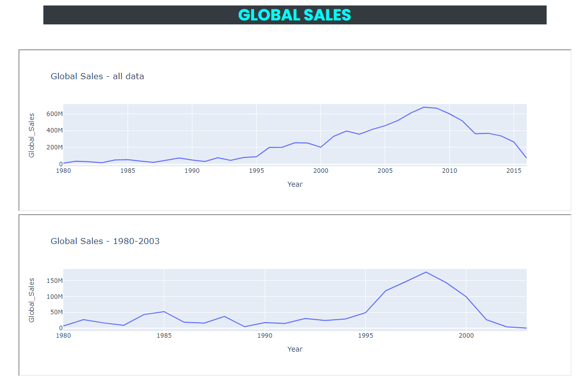
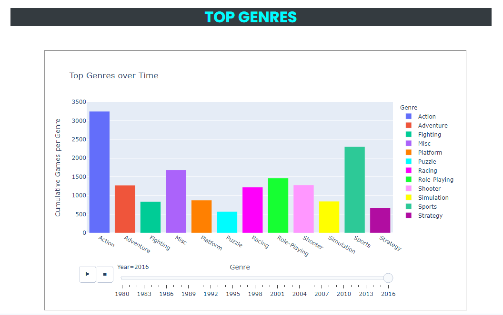
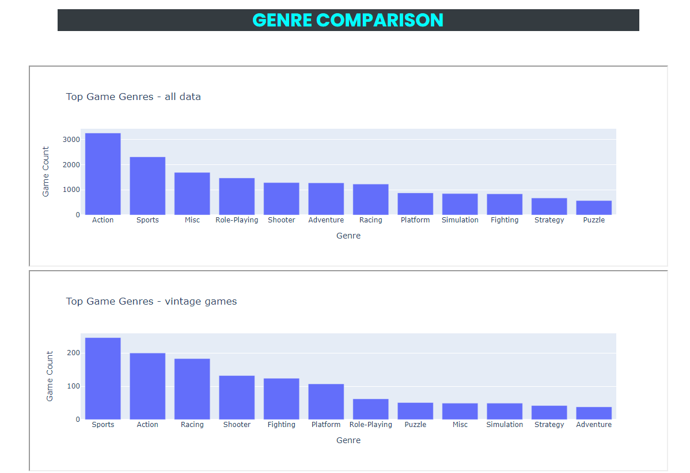
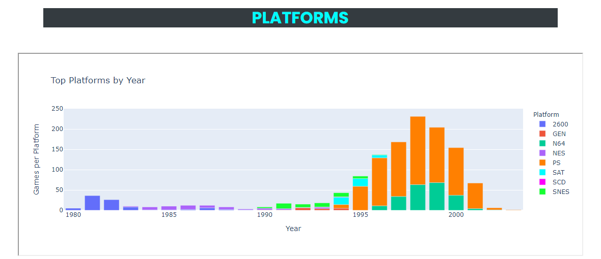
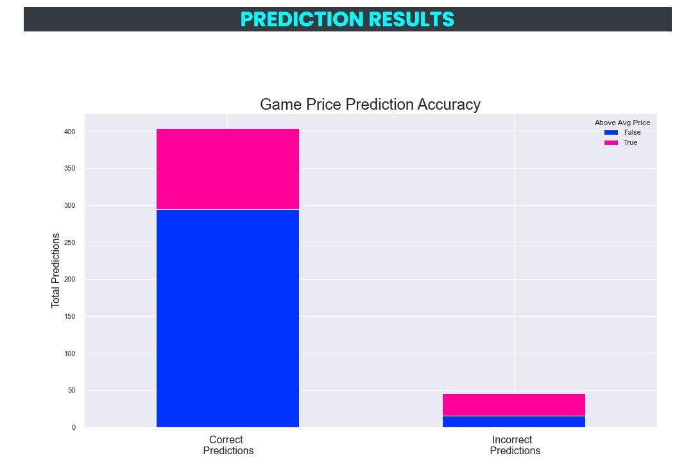
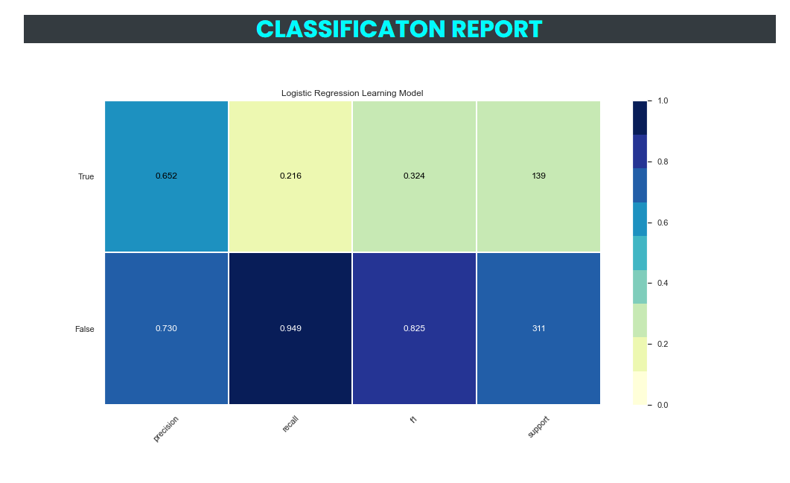
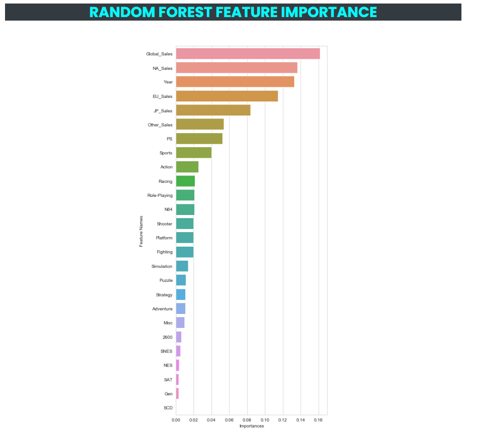
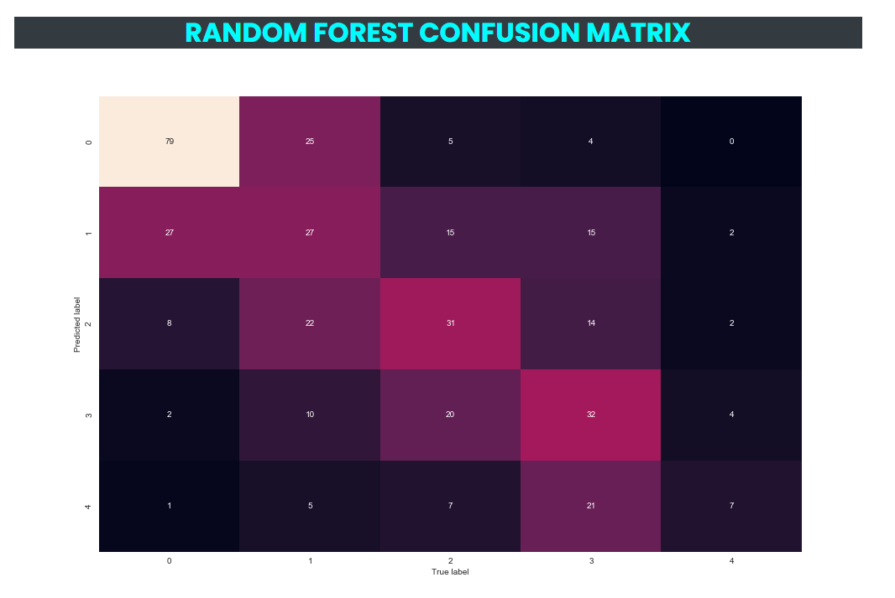

# Retro Gaming

# Project Contributors

- [Nicole Cook](https://github.com/Nicole1701)

- [Daren Hamilton](https://github.com/darenhamilton)

- [Michelle Hamilton](https://github.com/michelin96)

- [Erin Hislope](https://github.com/ehislope)

- [Johnny Whitaker](https://github.com/MrATX)

# Project Specifics

## Are Retro Game Profits in the Secondary Market Predictable?

In 1977, Atari released the Atari 2600, a gaming console that featured not only a joystick control, but also game cartridges which allowed users to play multiple games on one system, effectively launching a new era in video games and spawning such classics as Space Invaders and Pac Man. By 1985, Nintendo Entertainment System (NES) found its way to the US markets and put out such hits as Super Mario Brothers and The Legend of Zelda.

Throughout the 1980's and 1990's, other popular consoles were put on the market, each offering their own collection of games and appealing to a variety of players and playstyles. Some of these games sold very well and are synonymous with the era, while others barely made a profit.

These retro consoles are no longer sold, however, they have found a life in secondary markets such as Ebay. We wanted to see if the current value of a particular game in the used game market could be predicted by its sales when the game was originally released.

## Direct Link

[Retro Gaming Wesite](https://video-game-prediction.herokuapp.com/data)

## Data Sources

- **Video Game Sales**: [Video Game Sales](https://www.kaggle.com/gregorut/videogamesales). This data set contains the original sales figures for video games sold between 1980 and 2020, broken out by Year, Publisher, Platform and Market (NA, EU and JP).

- **Game Value Now**: [Games Value Now](https://gamevaluenow.com/). This sites contains the current selling price of games on Ebay. We used a simple scraper to pull the data from the site into useable csv files.

### Platforms for Analysis

For the purposes of this project, we analyzed the data for the following platforms (US Release Dates Listed Below):

- Atari 2600 (1977)
- Nintendo/NES (1985)
- Sega Genesis (1990)
- Super Nintendo/SNES (1990)
- Sega CD (1992)
- PlayStation/PS1 (1994)
- Sega Saturn (1995)
- Nintendo 64 (1996)

## Data Cleaning

### Web Scraper

The scraper code is in the [scrape_ETL.ipynb Jupyter Notebook file](https://github.com/Nicole1701/video-game-prediction/blob/main/notebooks/scrape_ETL.ipynb). On the first attempt, the price table for each platform was scraped individually. Since that required human assistance to get the data, it was not going work for the end goal of dynamically updating the tables. After some trial and error, in three nested loops all the data was able to be scraped in to one table and exported to a CSV file.

The outer loop creates the URL to be scraped and uses Beautiful Soup to parse the HTML to find all the table rows in the HTML table tag. In the second loop looks at each table row element while the third loop finds all the table data and removes the HTML markup. After all the HTML table data is pulled from the page, it is made in to a table (data frame) and appended to a list. The best feature of this scraper is that in one simple Pandas function, pd.concat(), the list of “tables” makes one complete table of all the data. In the final step, the price is changed from a string type to a floating number, which is needed for analysis.

### Data Cleaning

The data cleaning can be found in the [datacleaning.ipynb file](https://github.com/Nicole1701/video-game-prediction/blob/main/notebooks/datacleaning.ipynb). First the [Video Game Sales csv](https://github.com/Nicole1701/video-game-prediction/blob/main/data/vgsales.csv) was pulled in filtered for only the platforms we wanted to look at and then cleaned for any records with blank year. Next, the sales numbers were turned into currency so it could be analyzed and then, in order to make the join with the scraped file easier, all game names were put in upper case and any punctuation removed.

A similar cleaning process was used on the scraped data, along with removing any outliers from the Price column. In addition, two columns were added: Mean & Median which indicated if a game's price on the secondary market was above or below the mean/median. Once the files were cleaned, they were merged based on Game Title and Platform, leaving 1,283 records to analyze.

## Project Challenges

- One of the challenges we faced early on was to determine exactly which platforms we would consider in our analysis. It was finally decided that we would look at the major gaming platforms from 1977-1996. This seemed to give us enough records for machine learning while still keeping within the retro theme we wanted to maintain.
- We had originally planned on adding a button on the website to update the scraped data, but we ran out of time to add this feature. Most of the backend work was completed, however, so it can be added later.
- It took a while to get our footing on what type of machine learning models would work best for our data set. In the end we produced the following analysis: Prediction, Classification, Random Forest Feature Importance and Random Forest Confusion Matrix.

## Visualizations/Analysis

### General Game Analytics

The years and platforms that we used for our machine learning model hit peak global sales in 1998 at $177M. In the complete data set, you will see a peak of nearly three times that amount as the number of platforms and games expands.

By viewing the bar chart race you will see that the numbers of games and genres stays relatively low until around 2000 when the pace of growth speeds up and there is rapid growth in each category.

In this comparison, you can see that the top genres in the full data set and the vintage data set show that top two genres are Action and Sports but racing eventually gets replaced with Adventure, Shooter, and Role Playing games in popularity.

This chart gives context to the vintage game data set by showing the number of platforms available in a given year and active years for each platform.

### Prediction Analysis

The categories False and True indicate if the game price is above (True) the average price of all the games in the data set. Of the 311 game price values that are below the average price, 295 were predicted correctly and 16 incorrectly. For the 138 prices that were above the overall average, 109 were predicted correctly and 30 were not.

 - Using 35% of the data for testing gave us the best average of precision and recall as well as accuracy.  
 -   The overall accuracy of this machine learning model is 72%.
 -   Precision is intuitively the ability of the classifier not to label as positive a sample that is negative.
 -   Recall is intuitively the ability of the classifier to find all the positive samples.
 -   F1-Score can be interpreted as a weighted harmonic mean of the precision and recall, where an F1-Score reaches its best value at 1 and worst score at 0.
 -   Support is the number of occurrences of each class. In this case, how many instances of False and True were predicted.

 - Using the binned price column as the dependent variable.
 -   The overall accuracy of this machine learning model is 45% using five bins for 1151 unique price values.
 -   We first ran the model on the price column as the "y" value with no bins at 2 % success rate
 -   Next ran the model on the price column with 10 bins at 23% and then seven bins at 35%.
 -   Finally with 5 bins at 45%
 -   The chart above shows the feature importance order of the model

A confusion matrix provides a summary of the predictive results in a classification problem.

## Project Specific Requirements

1. Find a problem worth solving, analyzing ,or visualizing

2. Use Machine Learning in the context of technologies learned in class.

3. You must use: Scikit-Learn and/or another machine learning library

4. You must use at least two of the below:

   - Python Pandas

   - Python Matplotlib

   - HTML/CSS/Bootstrap

   - JavaScript Plotly

   - JavaScript D3.js

   - JavaScript Leaflet

   - SQL Database

   - MongoDB Database

   - Google Cloud SQL

   - Amazon AWS

   - Tableau

5. Prepare a 10-minute data deep-dive or infrastructure walkthrough that shows machine learning in the context of what we've already learned.
